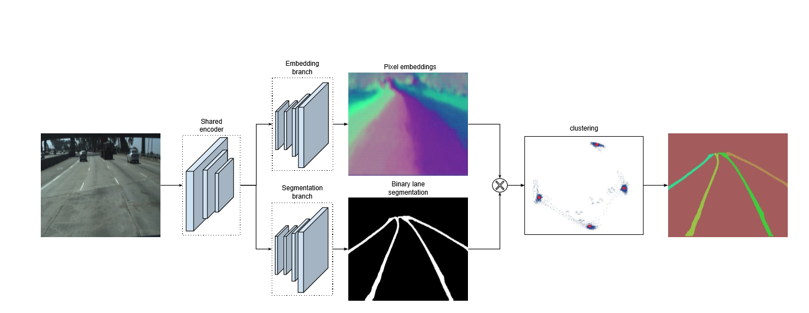
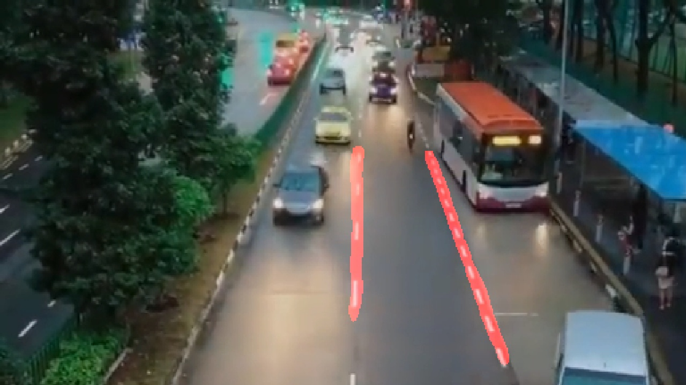

# LaneNet

## Network architecture


## Dataset

自制俯瞰视角车道线数据集，格式如下：

```
|----train_data/
|------|------gt_binary_image
|------|------gt_image
|------|------gt_instance_image/

|----test_data/
|------|------gt_binary_image
|------|------gt_image
|------|------gt_instance_image/
```

## Examples




## Usage
```
python train.py
python test.py
```

## Reference

https://github.com/Yiming992/LaneDetect
